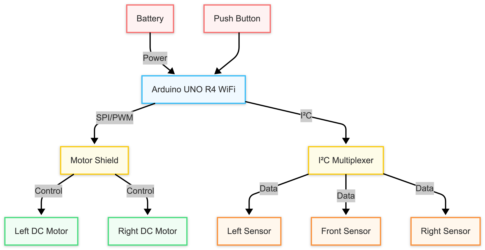
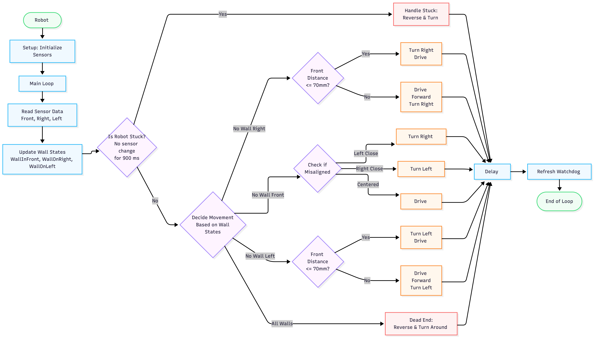
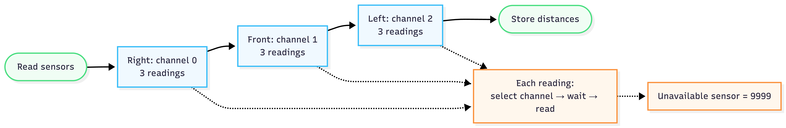

# Algorithm Explanation

## Overview

The Arduino Maze Solver Robot navigates an unknown maze by continuously reading distance measurements from three sensors and making movement decisions in real time.

Unlike robots that rely on preloaded maps or external control, this robot reacts only to its current surroundings. Sensor data is processed by the Arduino UNO R4 WiFi, which determines the next movement command and controls the motors accordingly.

The navigation software operates as a continuous feedback loop:

1. Collect sensor data.
2. Process environmental information.
3. Select a movement decision.
4. Execute the movement.
5. Repeat until the maze is completed.

This allows the robot to adapt to changing maze conditions without requiring prior knowledge of the maze layout.

 

## Hardware and Software Architecture

The robot combines sensing, processing, and motor control into a single autonomous system.

The Arduino UNO R4 WiFi acts as the central controller. It receives distance measurements from the Modulino sensors through the I²C multiplexer, processes the sensor data, and sends movement commands to the motor shield.

The motor shield then controls the DC motors to execute the selected movement.

 

## Main Algorithm Flow

The complete navigation process is shown below.

The robot continuously repeats this process while navigating the maze:

1. Read distance sensors.
2. Process sensor values.
3. Determine available paths.
4. Select the next movement.
5. Control the motors.
6. Check alignment and recovery conditions.
7. Repeat the cycle.

 

## Sensor Processing

The robot uses three Modulino distance sensors to detect surrounding walls and determine available paths.

The sensor collection process begins by communicating with each distance sensor through the I²C multiplexer. The Arduino then receives the measured distances and converts them into usable navigation data.

The robot collects three primary distance values:

| Sensor | Purpose |
|---|---|
| Front Sensor | Detects obstacles and walls directly ahead |
| Left Sensor | Detects walls on the left side for navigation and alignment |
| Right Sensor | Detects walls on the right side for navigation and alignment |

Each sensor reading is compared against a predefined threshold to classify the surrounding environment.

The sensor states are converted into simple navigation information:

- `frontDist`, `leftDist`, `rightDist`
- `wallInfront`, `wallOnLeft`, `wallOnRight`

This processed information is then passed to the movement decision algorithm.

## Navigation Strategy

The robot uses a rule-based navigation algorithm to solve unknown maze layouts.

At each decision point, the robot evaluates the available paths based on current sensor readings. The algorithm then selects the most appropriate movement based on the programmed priority rules.

Because the robot does not store a map of the maze, every decision is made using real-time sensor data.

This allows the robot to navigate environments it has not previously encountered.

 

## Decision-Making Process

The movement algorithm evaluates the surrounding environment and selects one of several possible actions:

- Move forward
- Turn left
- Turn right
- Reverse direction when encountering a dead end

The decision process can be summarized as:

| Sensor Condition | Movement |
| | |
| Preferred direction available | Turn toward preferred direction |
| Forward path available | Continue forward |
| Alternative path available | Turn toward available path |
| All paths blocked | Turn around |

The exact movement priority can be adjusted between software versions to balance reliability and speed.

 

## Movement Control

After the navigation algorithm selects a movement, the Arduino sends commands to the DRV8835 Motor Shield.

The motor shield controls the two DC motors and allows the robot to perform:

- Forward movement
- Left turns
- Right turns
- Reverse movement
- Stopping

Motor parameters were adjusted throughout development to improve turning accuracy, alignment, and overall completion time.

 

## Alignment and Recovery

To improve reliability, the robot continuously monitors its position while moving.

If the robot becomes misaligned or stops making progress, corrective actions are performed.

Recovery behaviors include:

- Adjusting motor speeds to correct alignment
- Reversing when the robot becomes stuck
- Changing direction to escape difficult positions

These features allow the robot to recover without requiring manual intervention.

 

## Software Versions

This repository contains two versions of the maze-solving software.

### Standard Version

The standard version prioritizes reliability and consistent maze completion.

Characteristics:

- Slower movement speed
- More conservative movement adjustments
- Improved stability during navigation

This version was designed for dependable performance.

 

### Optimized Version

The optimized version focuses on improving completion speed.

Characteristics:

- Increased movement speed
- Adjusted movement parameters
- Reduced completion time

This version demonstrates the trade-off between speed and reliability when optimizing autonomous systems.

 

## Algorithm Limitations

The current navigation system was designed for the UCI ICS Intelligent Robotics Summer Academy maze competition.

Performance may vary depending on:

- Maze dimensions
- Wall spacing
- Sensor accuracy
- Surface reflectivity
- Robot alignment

Future improvements could include more advanced mapping, path planning, and adaptive navigation techniques.

 

## Future Improvements

Potential improvements include:

- Faster sensor processing
- Dynamic motor speed adjustment
- Improved turning accuracy
- More efficient path planning
- Additional sensor feedback
- Machine-learning-based navigation strategies
