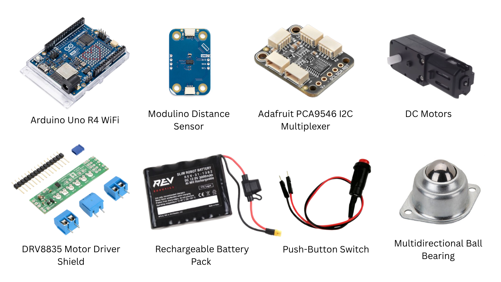
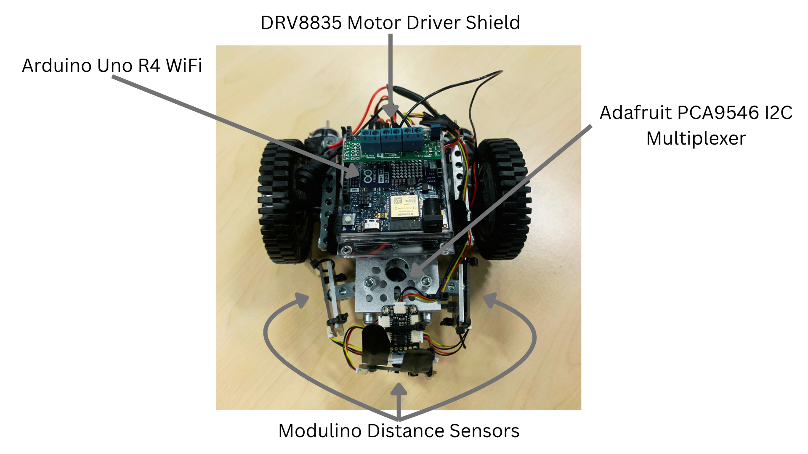
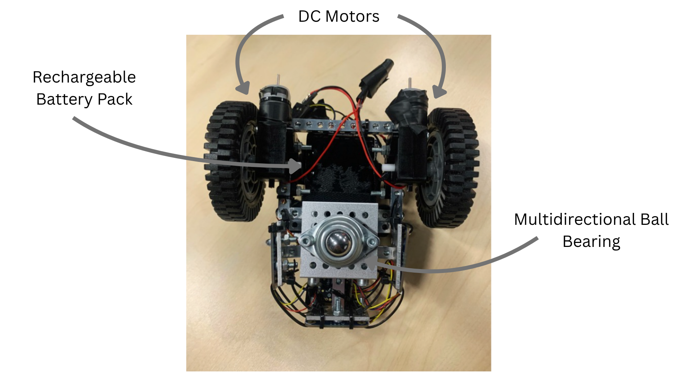

# Hardware Documentation

## Overview
The Arduino Maze Solver Robot is built around an Arduino UNO R4 WiFi microcontroller connected to distance sensors, motor controllers, and DC motors. The hardware allows the robot to detect maze walls, process sensor data, and autonomously navigate through unknown environments.

## Hardware Components
This diagram displays the primary electronic components driving the robot's navigation and power systems:

| Component | Purpose |
| :--- | :--- |
| **Arduino UNO R4 WiFi** | Main microcontroller responsible for processing sensor data and controlling movement |
| **Modulino Distance Sensors (x3)** | Detect nearby walls and obstacles |
| **Adafruit PCA9546 I2C Multiplexer** | Allows multiple distance sensors to communicate through the same I2C connection |
| **DRV8835 Motor Driver Shield** | Controls power delivery to the DC motors |
| **DC Motors** | Provide movement and turning capability |
| **Battery Pack with Push-Button Switch** | Powers the robot and provides an easy way to turn it on and off |
| **Multidirectional-Bearing** | Allows the robot to have frictionless and multidirectional movement |
| **Robot Chassis** | Supports the electronics and mechanical components |

## Robot Design

The images below show the completed robot with its major hardware components labeled. Together, the top and bottom views illustrate the placement of the sensors, control electronics, drive system, and power components.

### Top View

The top view highlights the primary control electronics and sensing components, including the Arduino UNO R4 WiFi, motor shield, I²C multiplexer, and the front, left, and right distance sensors.

### Bottom View

The bottom view illustrates the robot's drivetrain and supporting hardware, including the DC motors, wheels, battery push-button, and other underside components that are not visible from above.

Overall, the robot was designed to fit within the competition maze dimensions while maintaining enough space for sensors, motors, and electronics.

## Sensor System
The robot uses multiple distance sensors positioned around the chassis to detect surrounding walls. Because the Modulino Distance Sensors share the same default I2C address, they route through the **Adafruit PCA9546 I2C Multiplexer** so the microcontroller can poll each sensor independently.

### Sensor Placement
* **Front Sensor:** Measures distance directly ahead to prevent head-on collisions and trigger turning routines.
* **Left Sensor:** Monitors the left wall to guide left-wall-following algorithms or verify open paths.
* **Right Sensor:** Monitors the right wall to guide right-wall-following algorithms or verify open paths.

These readings are continuously processed by the Arduino to determine the robot's next movement.

## Motor System
The Arduino controls the motors through the **DRV8835 Motor Driver Shield**, which mounts directly on top of the Uno to handle current amplification safely. The motor system allows the robot to:
* Move forward in straight corridors
* Turn 90 degrees left or right at intersections
* Pivot 180 degrees in dead ends
* Dynamically adjust left/right wheel speeds to correct alignment mid-run

## Physical Specifications

| Specification | Measurement |
| :--- | :--- |
| **Robot Width** | 7 inches |
| **Robot Length** | 9 inches |
| **Maze Grid Size** | 14 × 14 inches |
