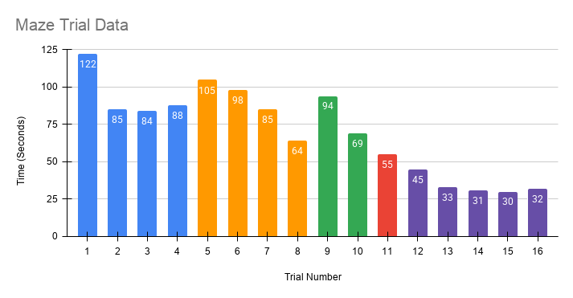

# Testing and Evaluation

## Overview

The Arduino Maze Solver Robot was developed through an iterative testing process consisting of sixteen full maze-solving trials. After each trial, observations were recorded and the robot's hardware or software was modified to improve performance.

Testing focused on increasing reliability, reducing completion time, improving navigation accuracy, and preparing the robot for competition.

## Trial Performance

The graph below shows the robot's maze completion time over the course of sixteen development trials.

The overall trend demonstrates a significant reduction in completion time as movement parameters, sensor processing, and navigation logic were refined.

## Trial Results

| Trial | Time (min:sec) | Observations | Future Goals |
|:---:|:---:|---|---|
| 1 | 2:02 | The robot kept bumping into walls and frequently got stuck while turning. | Improve the wall detection rate and make the robot turn a wider angle when stuck to get out faster. |
| 2 | 1:25 | It's movement was quite slow. | Increase the robot's overall movement speed to solve the maze faster. |
| 3 | 1:24 | It was able to navigate the maze reliably, but at a slow speed. | Increase the robot's speed even more in order to solve the maze faster. Adjust turning values and wall detection thresholds accordingly. |
| 4 | 1:28 | Although the robot got stuck a few times, it was able to get itself out. | Increase the speed to improve the robot's efficiency. Work on a stuck detection system that allows the robot to break away from walls and realign itself within the maze.|
| 5 | 1:45 | The robot got confused at one left turn and went all the way to the beginning but ended up completing the harder maze. The robot's turns were below 90 degrees. | Increase the speed and fine-tune the turning behavior. |
| 6 | 1:38 | Turns were too aggressive. The robot went faster because of the speed increase; however, it was turning too early. | Fix the turning timing and sensor detection to accommodate the faster speed, and increase the delay before turning. |
| 7 | 1:25 | The robot kept ramming into the wall and was not performing the unstuck function. A manual reset was required. | Fine-tune the delays and sensor values. |
| 8 | 1:04 | The robot was still ramming into walls occasionally. The realignment function was causing the robot to turn too much. | Reduce the impact of the misalignment function and make the robot turn slightly faster. |
| 9 | 1:34 | The robot kept turning the wrong way and repeatedly hit walls. | Reduce the delay before turning. Improve misalignment correction and 90° turns. |
| 10 | 1:09 | The right sensor became loose and continuously detected the wheel. Despite this, the robot did not collide head-on with walls and eventually completed the maze. | Secure the right sensor to allow the robot to receive accurate real-time data. |
| 11 | 0:55 | The robot maintained fast navigation and successfully completed the maze despite a few minor wall contacts. | Continue fine-tuning wall thresholds and turn values. |
| 12 | 0:45 | The robot got stuck between its front and side sensors, causing stuck detection to fail. | Add a physical barrier between the front and side sensors to prevent this issue and reduce timer for stuck detection. |
| 13 | 0:33 | The robot finished the maze very efficiently, and stuck detection worked flawlessly. | Nothing left to fix. |
| 14 | 0:31 | The robot rammed into walls on multiple occasions before turning, but successfully recovered afterwards. | Decrease the delay before turning to prevent the robot from contacting the walls. |
| 15 | 0:30 | It achieved its fastest maze completion while successfully navigating despite a few minor wall collisions. | Values and thresholds do not need any more fine tuning. Add a Watch Dog timer system in case the Arduino crashes unexpectedly. |
| 16 | 0:32 | The Arduino crashed unexpectedly during the run. The watchdog timer automatically reset the system, allowing the robot to resume navigation and complete the maze with only a small delay. | Ready for competition!! |

## Development Progress

Repeated testing led to continuous improvements throughout the project.

Major improvements included:

- Increasing overall movement speed
- Refining left and right turning behavior
- Improving wall detection accuracy
- Reducing unnecessary delays
- Improving robot alignment
- Enhancing stuck detection and recovery
- Correcting sensor mounting issues
- Adding watchdog timer recovery for improved robustness

Each modification was validated through additional maze-solving trials before being incorporated into the final competition version.

## Competition Performance

The final version of the robot was entered into the UCI ICS Intelligent Robotics Summer Academy Maze Competition.

| Category | Result |
|---|---|
| Competition | UCI ICS Intelligent Robotics Summer Academy |
| Placement | 🥇 1st Place |
| Teams | 8 |
| Maze Size | 6 × 3 Grid |
| Cell Dimensions | 14 × 14 inches |
| Final Competition Time | ~45 seconds |

## Key Findings

The testing process demonstrated that repeated iteration substantially improved both the speed and reliability of the robot.

Throughout development:

- Maze completion time decreased from over two minutes to approximately thirty seconds.
- Navigation became more consistent as movement parameters were refined.
- Sensor processing and recovery logic significantly reduced failures caused by collisions and dead ends.
- Hardware refinements, including improved sensor placement and watchdog timer recovery, increased the robustness of the final system.

By the end of testing, the robot was capable of navigating the competition maze quickly and autonomously, ultimately earning first place in the final competition by solving the maze in under a minute.
